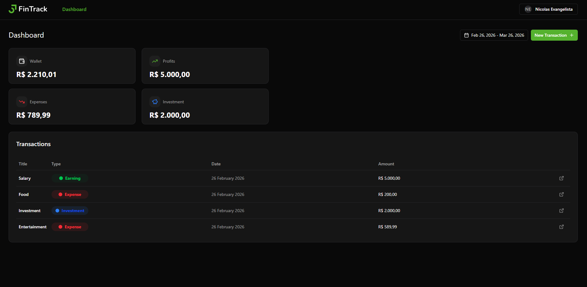
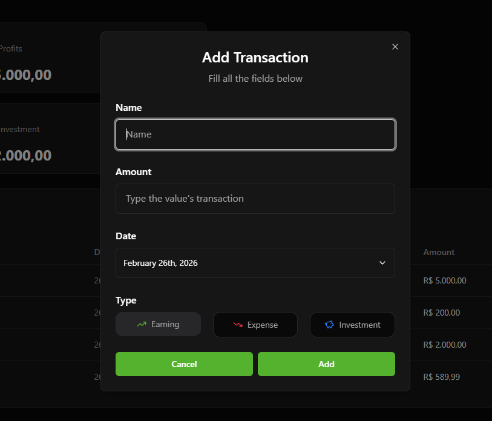
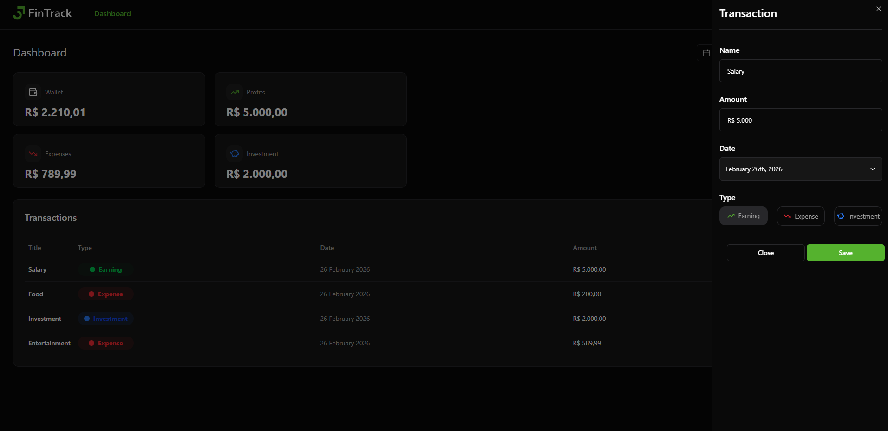

# 💰 FinTrack – Personal Finance Management

FinTrack is a modern full-stack-ready personal finance application built with **React + Vite**, focused on clean architecture, scalability, and best development practices.

The application allows users to manage **expenses, income, and investments**, providing authentication, secure token handling, and structured data management.

---

## 🚀 Live Demo

🔗 **Deployed Application:**  
fintrack-two-lac.vercel.app

---

## 🖼️ Application Screenshots

### 🏠 Home Dashboard
Displays the main overview with the transactions table and filtering by date range.



---

### ➕ Add Transaction Form
Form to register a new income, expense, or investment with validation using Zod.



---

### ✏️ Edit Transaction
Interface to update an existing transaction with prefilled form fields.



---

## 🚀 Tech Stack

### 🧩 Frontend
- React
- Vite
- React Router
- Tailwind CSS
- shadcn/ui (component library)
- Axios
- React Query
- Zod (schema validation)

### 🛠️ Code Quality & Tooling
- ESLint
- Prettier
- Git Hooks
- Conventional Commits

### 🔐 Authentication & Security
- JWT Authentication
- Access Token & Refresh Token
- Axios Interceptors for token injection & refresh handling
- Context API for global auth state

---

## ✨ Features

### 🔐 Authentication
- User signup
- User login
- Logout
- JWT-based authentication
- Automatic token refresh handling

### 💸 Financial Management
- Add transactions:
  - Income
  - Expense
  - Investment
- Edit transactions
- List transactions in a structured table
- Filter transactions by date range

### 🧠 Form Handling & Validation
- `useForm` hook for structured form handling
- Schema validation with Zod
- Real-time validation feedback

### 🌐 API Architecture
- Axios for HTTP requests
- Service layer abstraction for API calls
- Custom hooks powered by React Query
- Centralized request handling with interceptors

---

## 🏗️ Architecture Overview

The project follows a modular and scalable structure:

```bash
src/
│
├── services/          # API service layer
├── hooks/data/        # Custom hooks (React Query integration)
├── contexts/          # Global state management (Auth Context)
├── pages/             # Application pages
├── components/        # Reusable UI components
└── lib/               # Utilities & configurations
```

### Key Architectural Decisions

- 🔹 Separation of concerns (UI vs Data Fetching vs Services)
- 🔹 Centralized API communication
- 🔹 Token lifecycle handling via interceptors
- 🔹 Reusable and testable custom hooks
- 🔹 Clean commit history with Conventional Commits

---

## 📊 Core Functional Flow

1. User authenticates (login/signup)
2. JWT access token is stored
3. Axios interceptors attach tokens to requests
4. If expired, refresh token flow is triggered
5. Transactions are managed via service layer + React Query
6. UI automatically updates through cache invalidation

---

## ▶️ How to Run Locally

1. Clone the repository:

```bash
git clone https://github.com/nicolasandreos/Fintrack.git
cd Fintrack
```

2. Install dependencies:

```bash
npm install
```

3. Run the development server:

```bash
npm run dev
```

The application will be available at:

```
http://localhost:5173
```
